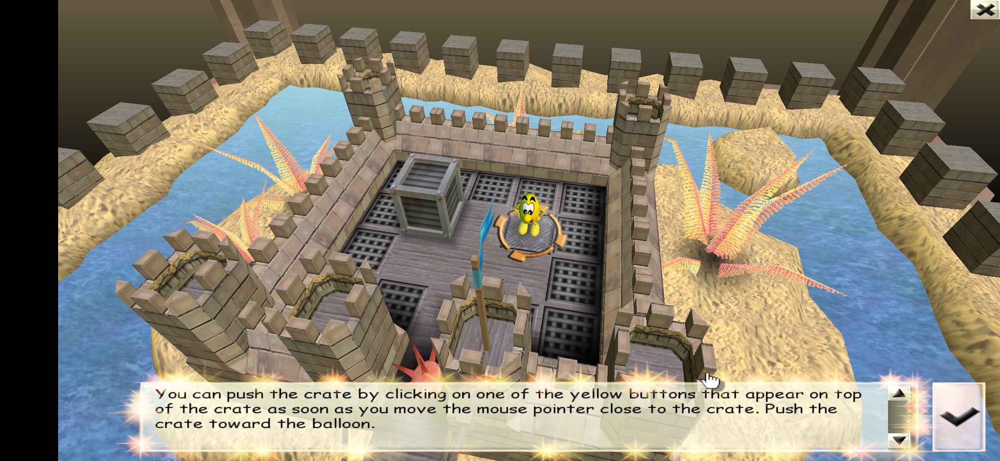
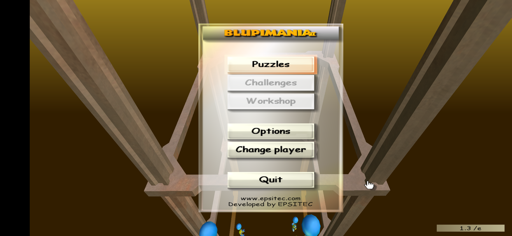

# BlupiMania 2 for Android

An open-source Android port of the classic 2001 puzzle game **BlupiMania 2**, created by
**Epsitec SA** and **[Daniel Roux](https://www.maniabricks.com/)**.

The original game is a Windows title built on a Direct3D 7 engine. This project keeps the
original game code intact and adds a compatibility layer underneath it, so the game runs
natively on Android with full touchscreen support.

<p align="center">
  
  
</p>

## Credits & Trademark

* Original game and source code: **Epsitec SA** and **Daniel Roux**
  ([maniabricks.com](https://www.maniabricks.com/)) — <https://blupi.org>
* Upstream source: the [`blupimania2`](https://github.com/colobot/colobot/tree/blupimania2)
  branch of the [Colobot](https://github.com/colobot/colobot) project, maintained by the
  TerranovaTeam / Colobot community.
* **"Blupi" is a registered trademark in Switzerland held by Epsitec SA.**

This port is **free of charge, non-commercial, contains no ads and no in-app purchases**.
It is an unofficial, fan-made port, published with the express written permission of
Epsitec SA.

## License

The original game code and assets are **Copyright (C) Epsitec SA / Daniel Roux** and are
made available under the **GNU General Public License v3**. This port, including all
changes in this repository, is likewise released under the **GPLv3** — see [LICENSE](LICENSE).

Permission for this port was granted in writing by **Pierre Arnaud, CEO of Epsitec SA**
(28 May 2026):

> "As long as the game is released under GPLv3 and you don't sell or lease it, you are
> welcome to use the name Blupi, which is a registered trademark in Switzerland held by
> Epsitec SA. You should mention this in the accompanying documentation."

**Mathieu Schroeter** (Epsitec SA) additionally confirmed that the assets are covered by
the same GPL3 license as the source code.

## What was ported

The original game logic, level data, scripting engine (CBot) and rendering flow are
**unmodified**. Everything below the game was rewritten:

| Original (2001, Windows) | This port |
| --- | --- |
| Win32 (`WinMain`, message loop) | SDL2 |
| Direct3D 7 fixed-function pipeline | OpenGL ES 2.0 (übershader emulating the FFP) |
| DirectDraw surfaces | CPU pixel buffers + GL textures |
| DirectSound (3D buffers, envelopes) | custom SDL2 audio mixer (pitch/pan/envelopes) |
| DirectInput | SDL2 joystick |
| Mouse & keyboard | Touchscreen gestures |

Layout:

```
src/     original game code (minimal, documented changes only)
port/
  compat/  Win32 + DirectX 7 shim headers (windows.h, d3d.h, ddraw.h, dsound.h, ...)
  gl/      IDirect3DDevice7 implemented over OpenGL ES 2.0
  sdl/     SDL2 platform layer, texture manager, audio mixer, Android bootstrap
android/   Gradle project (SDL2 activity, asset packaging)
```

## Touch controls

| Gesture | Action |
| --- | --- |
| Tap | Click — move Blupi, press buttons |
| One-finger drag | Pan the camera across the map |
| Two-finger pinch | Zoom in / out |
| Two-finger horizontal drag | Rotate the camera |
| Tap during the intro cinematic | Skip it |

## Download

Grab the latest APK from the [Releases](../../releases) page.
Requires Android 5.0 (API 21) or newer; arm64-v8a and x86_64 builds are included.

## Building from source

You need the Android SDK, NDK r26+ and JDK 17.

```bash
git clone --recursive https://github.com/sid14925/blupimania2-android.git
# SDL2 sources must sit next to the repository:
#   ../SDL2-src   (SDL 2.30.x)
cd blupimania2-android/android
./gradlew assembleDebug
```

### Game data

The build packages the original game data (`blupimania1.dat`, `blupimania2.dat`,
`blupimania3.dat`, `scene/`, `defi/`, `diagram/`, `files/`) into the APK assets. To keep
this repository to source code only, the data files are **not** committed here — copy them
from your own installation of the game into `android/app/src/main/assets/data/` (lowercase
names), then regenerate the file list:

```bash
# from android/app/src/main/assets/data/
find . -type f ! -name assets.lst ! -name data.ver | sed 's|^\./||' > assets.lst
echo "rip-1.3-port1" > data.ver
```

On first launch the app extracts these assets into its internal storage.

A desktop (Windows/Linux) build of the same port is also possible via the top-level
`CMakeLists.txt`; it is used for debugging. Run it with the `-touch` flag to test the
touch-style behaviour (camera drag direction, the touch controls page) with a mouse.

## Privacy

This app collects **no data whatsoever** — see [PRIVACY.md](PRIVACY.md).

## Development notes

This port was written with Anthropic's **Claude Fable 5**, and it is only fair to be
precise about who did what.

**Claude wrote essentially all of the port code** — the Win32/DirectX 7 compatibility
shims, the `IDirect3DDevice7` implementation on top of OpenGL ES 2.0, the SDL2 platform
layer, the audio mixer, the Android project — and diagnosed the platform-specific bugs
listed below.

**My part** was the direction and everything around the code: obtaining the permission from
Epsitec, sourcing the game data, deciding how the game should feel on a touchscreen, and
above all **testing every build on a real device**. That last part mattered more than it
sounds: the emulator is x86_64 and hid several bugs that only appear on real ARM hardware —
the missing water and dolphin, the ghost clicks after a camera pan, the cropped view on
first launch. Each of those was found by playing the game on a phone, then fixed in code.

A few notable porting pitfalls that took real debugging:

* `char` is **unsigned** on ARM but signed on x86/MSVC — the terrain and water level data
  broke silently on real devices while working fine on the x86 emulator.
* `long` is 8 bytes on LP64, which corrupted the 208-byte `.MOD` model file layout.
* Texture UV scroll offsets grow large over time; `mediump` precision made the water
  disappear on real GPUs.
* SDL's touch→mouse synthesis produced ghost clicks at the end of every camera pan.

Author: **Vilmos Cseke** — [GitHub](https://github.com/sid14925) ·
[YouTube](https://www.youtube.com/@csekevilmos408/videos)
